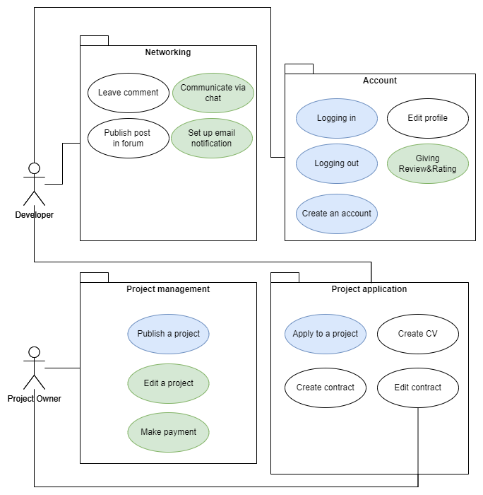

# Hobby Devs - Software Requirements Specification 

## Table of contents
- [Table of contents](#table-of-contents)
- [Introduction](#1-introduction)
    - [Purpose](#11-purpose)
    - [Scope](#12-scope)
    - [Definitions, Acronyms and Abbreviations](#13-definitions-acronyms-and-abbreviations)
    - [References](#14-references)
    - [Overview](#15-overview)
- [Overall Description](#2-overall-description)
    - [Vision](#21-vision)
    - [Use Case Diagram](#22-use-case-diagram)
    - [Technology Stack](#23-technology-stack)
- [Specific Requirements](#3-specific-requirements)
    - [Functionality](#31-functionality)
    - [Usability](#32-usability)
    - [Reliability](#33-reliability)
    - [Performance](#34-performance)
    - [Supportability](#35-supportability)
    - [Design Constraints](#36-design-constraints) 
    - [Online User Documentation and Help System Requirements](#37-online-user-documentation-and-help-system-requirements)
    - [Purchased Components](#38-purchased-components)
    - [Interfaces](#39-interfaces)
    - [Licensing Requirements](#310-licensing-requirements)
    - [Legal, Copyright And Other Notices](#311-legal-copyright-and-other-notices)
    - [Applicable Standards](#312-applicable-standards)
- [Supporting Information](#4-supporting-information)

## 1. Introduction

### 1.1 Purpose
This Software Requirements Specification (SRS) describes all specifications for the application "Hobby Devs". It includes an overview about this project and its vision, detailed information about the planned features and boundary conditions of the development process.

### 1.2 Scope
The Hobby Devs project will be realized as a web application, targeting both project owners and hobby developers. The key scopes include:

- User Account Management
- Project Publishing
- Project Applications
- Communication Features
- Data Storage and Management
- Search and Tagging Functionality

### 1.3 Definitions, Acronyms and Abbreviations
| Abbrevation | Explanation                            |
| ----------- | -------------------------------------- |
| SRS         | Software Requirements Specification    |
| UC          | Use Case                               |
| n/a         | not applicable                         |
| tbd         | to be determined                       |
| UCD         | overall Use Case Diagram               |

### 1.4 References

| Title                                                              | Date       | Publishing organization   |
| -------------------------------------------------------------------|:----------:| ------------------------- |
| [Hobby Devs Blog](http://commonplayground.wordpress.com)    | 17.09.2024 | Hobby Devs Team    |
| [GitHub](https://github.com/leoboehm/hobbydevs)              | 17.09.2024 | Hobby Devs Team    |

### 1.5 Overview
The following chapter provides an overview of this project with vision and Overall Use Case Diagram. The third chapter (Requirements Specification) delivers more details about the specific requirements in terms of functionality, usability and design parameters. Finally there is a chapter with supporting information. 
    
## 2. Overall Description

### 2.1 Vision
Hobby Devs is about creating a collaborative space, where ideas meet development. We want to connect people with innovative ideas to hobby developers who can bring these visions to life. Users can post their project ideas and developers can apply, providing their budget and time frame. Through ratings and reviews, the project idea can find the perfect developer, that will help you build ideas to reality.

### 2.2 Use Case Diagram

- Blue: Planned until end of november 2024
- Green: Planned until end of may 2025

### 2.3 Technology Stack

| **Category**        | **Technology**              |
|---------------------|-----------------------------|
| **Backend**         | PHP                         |
| **Frontend**        | Vue.js + Vuetify           |
| **IDE**             | Visual Studio Code          |
| **Project Management** | YouTrack, GitHub, Discord |
| **Deployment**      | tbd                         |
| **Testing**         | SonarCloud                         |

## 3. Specific Requirements

### 3.1 Functionality
This section will explain the different use cases, you could see in the Use Case Diagram, and their functionality.  
Until November we plan to implement:
- 3.1.1 Creating User Account
- 3.1.2 Logging in
- 3.1.3 Logging out
- 3.1.4 Publish Project
- 3.1.5 Applying for a Project

Until May, we want to implement:
- 3.1.6 Give Rating
- 3.1.7. Project Editing
- 3.1.8. Profile Editing

#### 3.1.1 Create User Account
This use case allows new users to register and create an account on the platform. The user's data will be securely stored in the database.

[Create User Account](./use_cases/UC1_Create_User_Account.md)

#### 3.1.2 Logging in
The website will provide the possibility to register and log in. This will also make the usability easier when a user wants to ... because they don't have to enter their mail address every time.

[Logging in](./use_cases/UC2_Login.md)

#### 3.1.3 Logging out
In case you share your device, have multiple accounts or just want to be cautius about your privacy you should be able to manually log out.

[Logging out](./use_cases/UC3_Logout.md)

#### 3.1.4 Publish Project
In this feature every very user can create new operations, making him the owner of the newly created project. In this process, the project owner should provide detailed information for users to look at and select the project that they want to participate in. 

[Publish Project](./use_cases/UC4_Publish_Project.md)

#### 3.1.5 Applying for a Project
This feature is the essential one of our project. The developer gets the possibility to fill out an application form for their desired project. Therefore, they have to fill out a form with their name, skills, availability, past experience, motivation and contact information.

[Applying for a Project](./use_cases/UC5_Applying_for_a_Project.md)

#### 3.1.6 Give Rating
...

[Giving Rating](./use_cases/UC6_Giving_Rating.md)

#### 3.1.7 Project Editing
...

[Project Editing](./use_cases/UC7_Project_Editing.md)

#### 3.1.8 Profile Editing
...

[Profile Editing](./use_cases/UC8_Profile_Editing.md)

## 3.2 Usability
tbd

### 3.2.1 No Training Time Needed
tbd

### 3.2.2 Familiar Feeling
tbd

## 3.3 Reliability

### 3.3.1 Availability
tbd

### 3.3.2 Defect Rate
tbd

## 3.4 Performance

### 3.4.1 Capacity
tbd

### 3.4.2 Storage Efficiency
tbd

### 3.4.3 Website Performance / Response Time
tbd

## 3.5 Supportability

### 3.5.1 Coding Standards
tbd

### 3.5.2 Testing Strategy
tbd

## 3.6 Design Constraints
tbd

## 3.7 Online User Documentation and Help System Requirements
tbd

## 3.8 Purchased Components
Currently, we have no purchased components. Should any be acquired in the future, they will be documented in this section along with their licensing details.

## 3.9 Interfaces

### 3.9.1 User Interfaces
The user interfaces to be implemented include:
- **Dashboard**: Displays an overview of ongoing projects and user activity.
- **Project Management**: A page for creating, editing and viewing project details.
- **User Authentication**: Interfaces for registration and login.
- **User Profile**: A section for users to view and edit their personal information and settings.

### 3.9.2 Hardware Interfaces
(n/a)

### 3.9.3 Software Interfaces
tbd

### 3.9.4 Communication Interfaces
tbd

## 3.10 Licensing Requirements
Licensing requirements for third-party libraries and components used will be documented as they are identified, ensuring compliance with all relevant licenses.

## 3.11 Legal, Copyright, and Other Notices
tbd

## 3.12 Applicable Standards
tbd

## 4. Supporting Information
For any further information you can contact the Hobby Devs Team or check our [Hobby Devs Blog](https://hobbydevs.wordpress.com). 
The Team Members are:
- Leonie
- Zelong
- Yasi 
- Ephraim
- Azra
