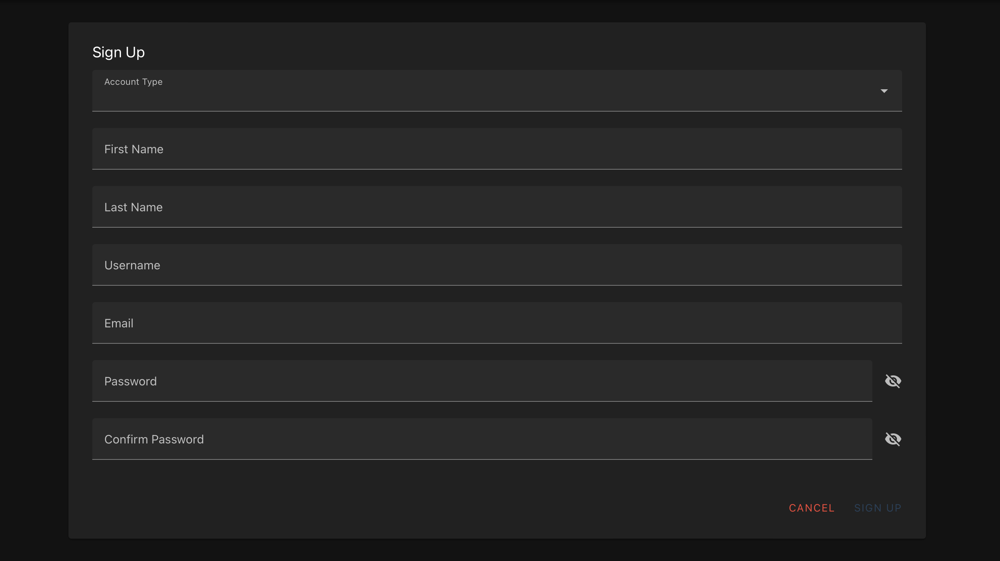
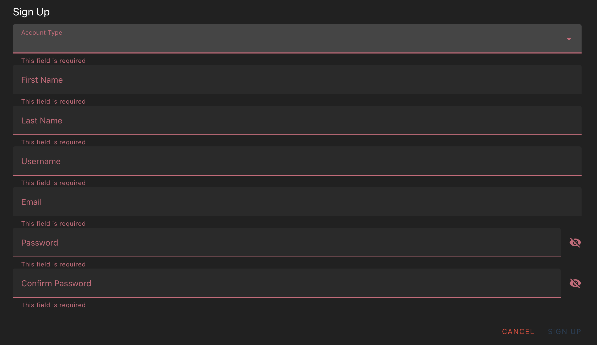
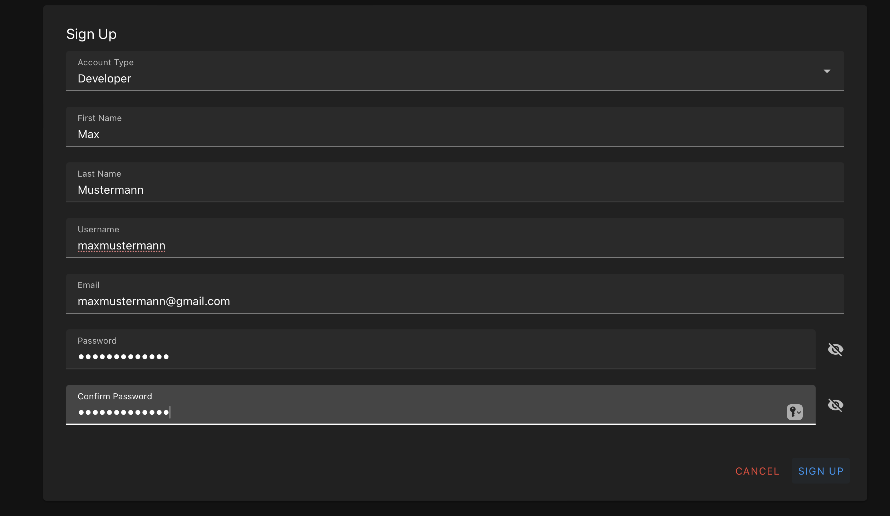
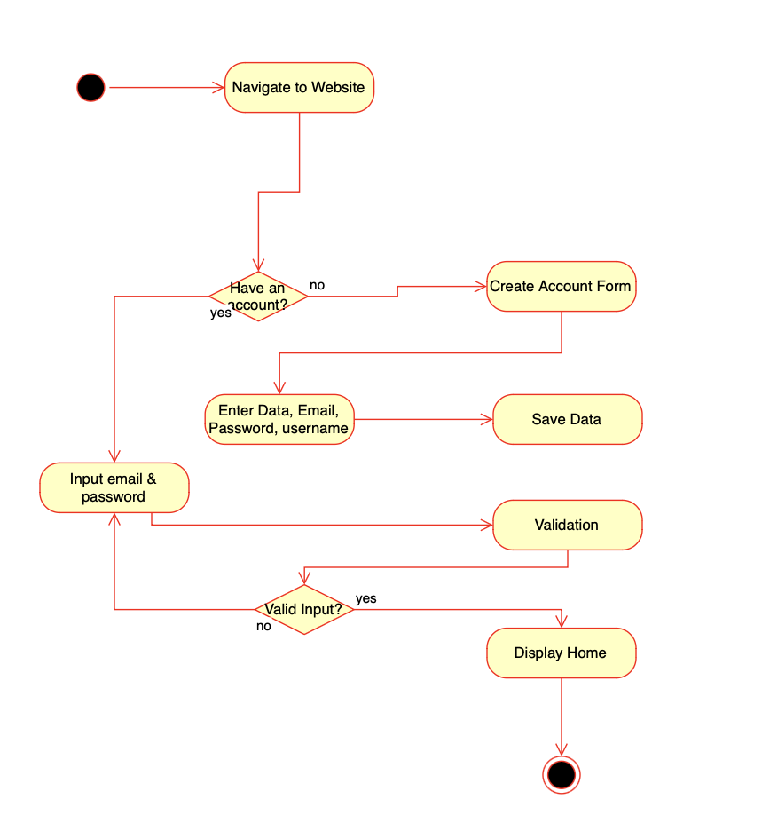

# Use-Case Specification: Create User Account

# 1. Create User Account
## 1.1 Brief Description
This use case allows new users to register and create an account on the platform. The user's data will be securely stored in the database, following security and privacy best practices.

## 1.2 Mockup 


## 1.3 Screenshots
### Required Fields Validation


### Completed Sign-Up Form


# 2. Flow of Events
## 2.1 Basic Flow
1. The user clicks on the "Register" button.
2. The "Registration Form" appears, prompting the user to input their details.
3. The user enters their data, including email, username, and password.
4. The user clicks on the "Submit" button.
5. The system validates the entered data.
6. If validation succeeds, the data is securely saved in the database, and a confirmation message is displayed.
7. The user is redirected to the login page.

### .feature File
The Gherkin script for this use case is available [here](../features/UC1_Create_User_Account.feature)

```gherkin
Feature: User Registration
  As a new user
  I want to create an account on the platform
  So that I can access its features and services

  Scenario Outline: Successful Registration
    Given the user enters "<field>" with "<value>"
    When the user clicks the "Submit" button
    Then the account is successfully created
    And the user is redirected to the login page

    Examples:
      | field      | value             |
      | Email      | test@example.com  |
      | Username   | newuser123        |
      | Password   | SecurePass1!      |

  Scenario: Missing Fields
    Given the user leaves one or more required fields empty
    When the user clicks the "Submit" button
    Then an error message is displayed indicating the missing fields
    And the account is not created

  Scenario: Invalid Email Format
    Given the user enters an invalid email address
    When the user clicks the "Submit" button
    Then an error message is displayed indicating the email format is invalid
    And the account is not created

  Scenario: Duplicate Email
    Given the user enters an email that is already registered
    When the user clicks the "Submit" button
    Then an error message is displayed indicating the email is already in use
    And the account is not created
```

### Activity Diagram


## 2.2 Alternative Flows
### Invalid Email or Password:
If the entered email or password format is incorrect, the system displays an error message and prompts the user to correct the input.

# 3. Special Requirements
- Users must have a valid email account to register.
- Passwords should adhere to the following security guidelines:
- Minimum length of 8 characters.
- Include at least one uppercase letter, one lowercase letter, one number, and one special character.

# 4. Preconditions
- The user is accessing the platform through a browser.
- The user clicks on the "Register" button to initiate the registration process.

# 5. Postconditions
## 5.1 Successful Registration:
- The user's data is encoded and saved securely in the database.

## 5.2 Failed Registration:
- An appropriate error message is displayed, and the user remains on the registration screen.

### 5.1 Save changes / Sync with server
Data gets encoded and saved in database

# 6. Function Points
n/a

# 7. CRUD Operation
This Use Case represents the **Create** operation in the CRUD model, as it involves the creation of a new user account.
