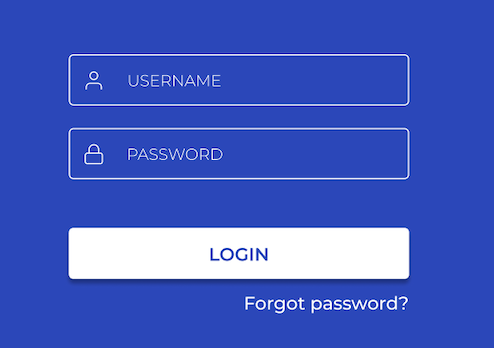
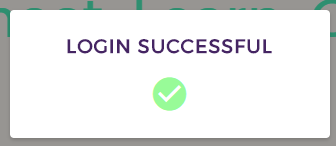
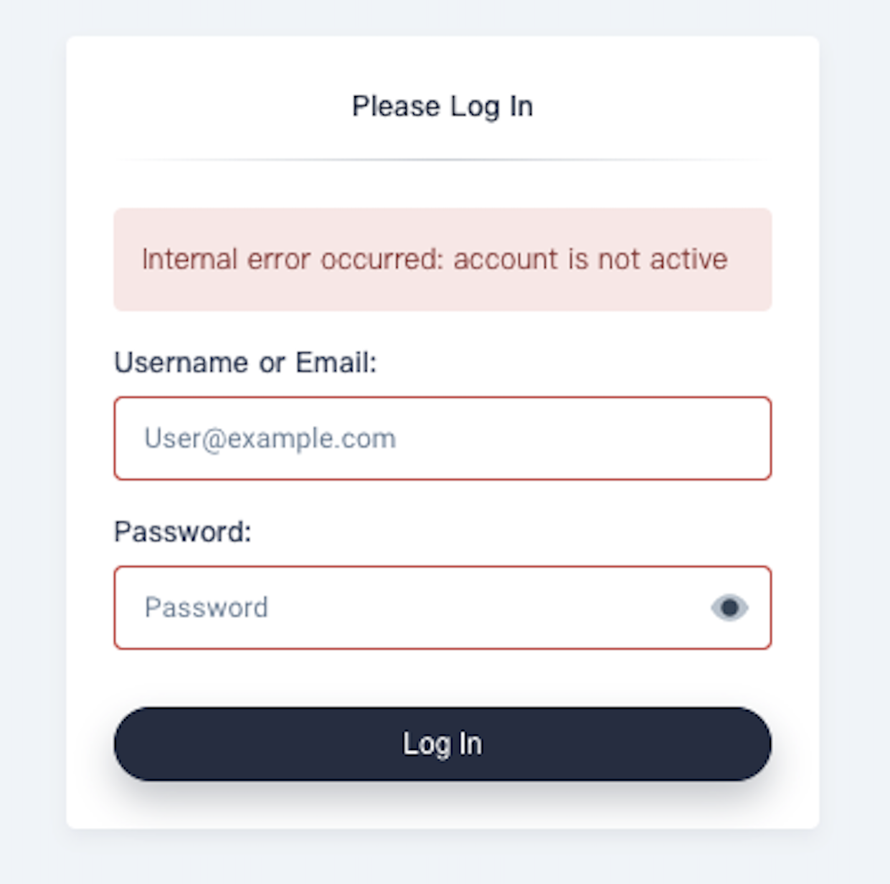
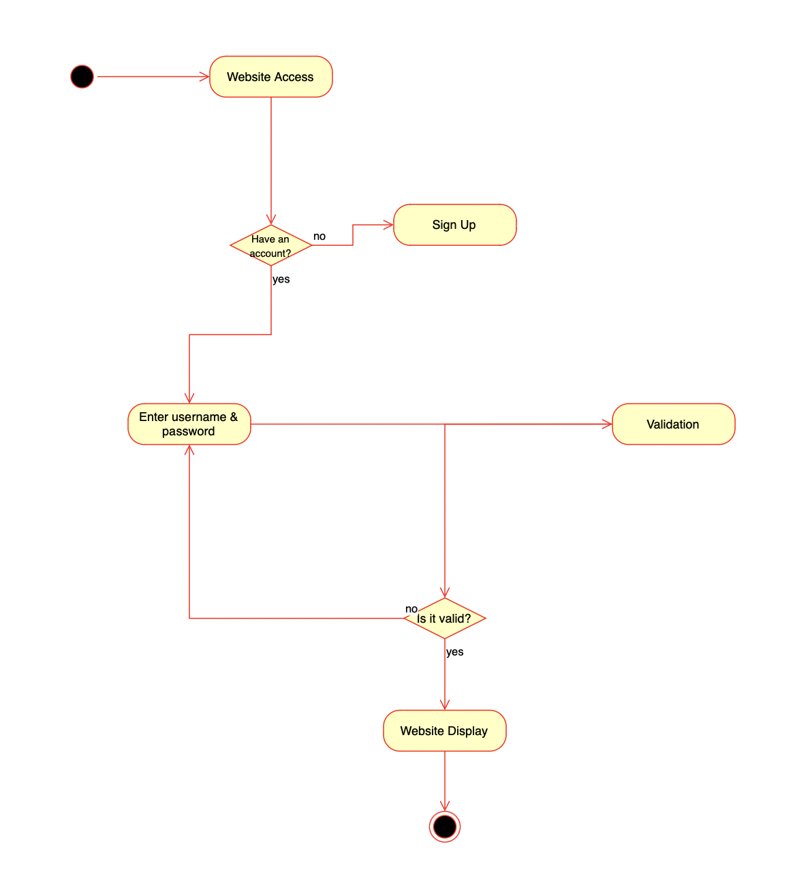

# Use-Case Specification: Login

## 1. Login

### 1.1 Brief Description
This use case enables users to log into the platform by providing valid login credentials. The login form should include fields for a username and password. Upon successful login, the user is granted access to their dashboard.

### 1.2 Mockup


### 1.3 Screenshots
### Login Sucessful


### Login Fail


## 2. Flow of Events

### 2.1 Basic Flow
1. The user clicks on the "Login" button.
2. The "Login Form" appears with fields for username and password.
3. The user enters their credentials.
4. The user clicks on the "Submit" button.
5. The system verifies the credentials.
6. If the credentials are valid, the user is redirected to their dashboard.

### Activity Diagram


### .feature File

The Gherkin script for this use case is available [here](../features/UC2_Login.feature).

```gherkin
Feature: User Login
  As a registered user
  I want to log into the platform
  So that I can access my personal dashboard

  Scenario Outline: Successful login
    Given the user enters "<field>" with "<value>"
    When the user clicks the "Submit" button
    Then the user is successfully logged in
    And they are redirected to their dashboard

  Examples:
    | field          | value       |
    | Username       | johndoe     |
    | Password       | correctpass |

  Scenario: Incorrect password
    Given the user enters a valid username but incorrect password
    When the user clicks the "Submit" button
    Then an error message is displayed
    And the user is not logged in

  Scenario: Missing credentials
    Given the user leaves the "Password" field empty
    When the user clicks the "Submit" button
    Then an error message is displayed indicating the missing information
    And the user is not logged in
```

## 2.2 Alternative Flows
- The user cancels the login process.
- The user submits incomplete or incorrect data.

# 3. Special Requirements
- Password field should be obscured.
- Error messages should not specify if it was the username or password that was incorrect for security reasons.

# 4. Preconditions
- The user must be registered on the platform.

# 5. Postconditions
- Successful login: The user gains access to the platform and is redirected to their dashboard.
- Unsuccessful login: An error message is displayed, and the user remains on the login screen.

# 6. Function Points
n/a

# 7. CRUD Operation
This Use Case represents the "Read" operation in the CRUD model, as it involves verifying an existing user's credentials.
