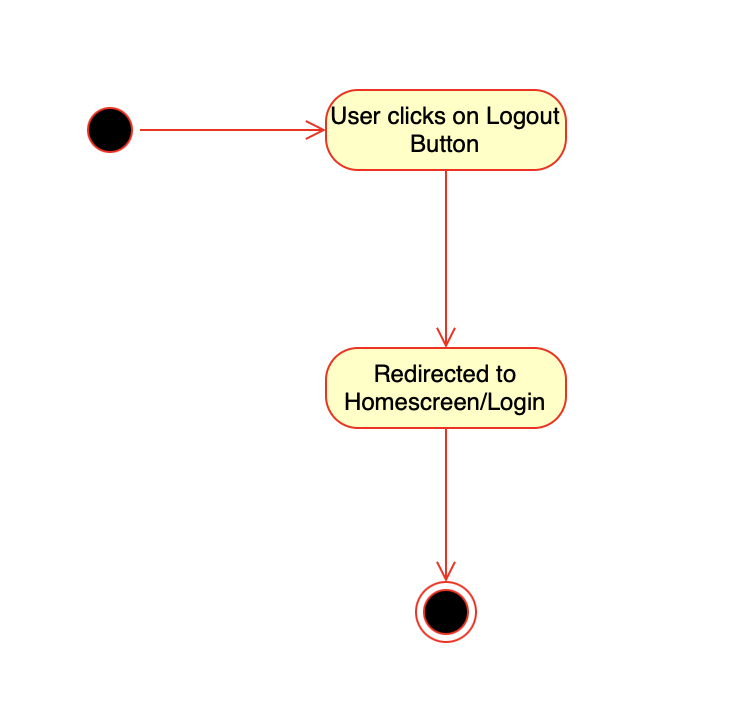

# Use-Case Specification: Logout

## 1. Logout

### 1.1 Brief Description
This use case allows users to log out of the platform. Once logged out, the user will be redirected to the homepage or login screen, ending their current session.

### 1.2 Mockup


## 2. Flow of Events

### 2.1 Basic Flow
1. The user clicks on the "Logout" button.
2. The system prompts a confirmation message (optional).
3. The user confirms the logout action (if applicable).
4. The system ends the user session.
5. The user is redirected to the homepage or login screen.

### Activity Diagram


### .feature File

The Gherkin script for this use case is available [here](../features/UC3_Logout.feature).

```gherkin
Feature: User Logout
  As a logged-in user
  I want to log out of the platform
  So that I can end my session securely

  Scenario: Successful logout
    Given the user is logged in
    When the user clicks the "Logout" button
    Then the user is successfully logged out
    And the system redirects them to the homepage

  Scenario: Logout confirmation (optional)
    Given the user clicks "Logout"
    When the confirmation message is shown
    And the user confirms logout
    Then the user is logged out
    And redirected to the login page
```

## 2.2 Alternative Flows
- The user cancels the logout action after the confirmation prompt (if applicable).
- The session timeout logs the user out automatically.

# 3. Special Requirements
- Session data should be cleared to ensure a secure logout.
- A confirmation message may be optional but should add security.

# 4. Preconditions
- The user must be logged in to access the logout option.

# 5. Postconditions
- Successful logout: The user is logged out, session is ended, and they are redirected to the homepage or login screen.
- Unsuccessful logout (canceled action): The user remains logged in and on the same page.

# 6. Function Points
n/a

# 7. CRUD Operation
This Use Case represents a "Delete" operation in the CRUD model, as it involves ending or "deleting" the user's current session.
