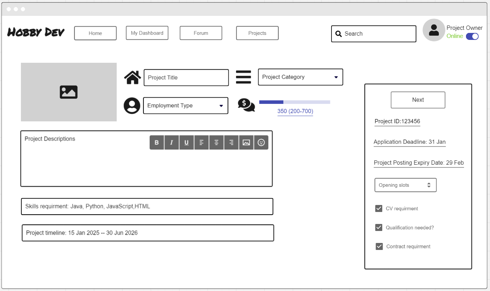
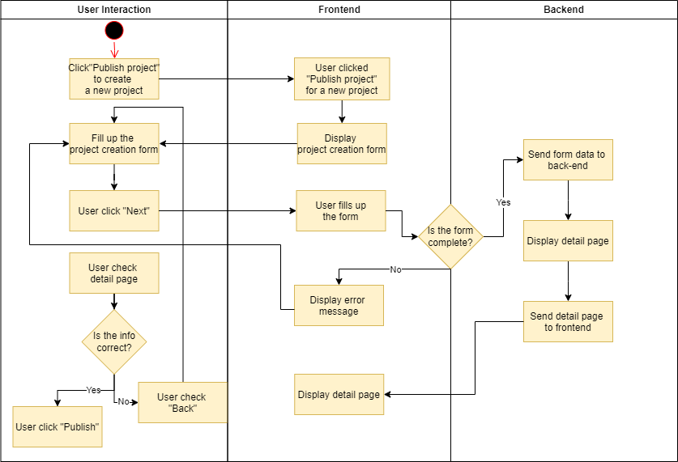

# Use-Case Specification: Publish Project

# 1. Publish Project

## 1.1 Brief Description
Every normal user can create new operations, making him the owner of the newly created project. In this process, the project owner should provide detailed information for users to look at and select the project that they want to participate in. These are the fields that are necessary for any project to be published:

- project name
- project category
- employment type
- required skills
- project description
- salary range(must have)
- duration of the project
- application requirment

By filing up the form as detailed as possible, the project owner can find the most suitable developer to help his project.

## 1.2 Mockup 

# 2. Flow of Events

## 2.1 Basic Flow
1. The project owner clicks on the "Publish new project" button.
2. The project owner fills up the form.
3. The project owner clicks on "Next" button.
4. The project owner checks the detailed form.
5. The project owner clicks the button "Publish" to publish the new project.

### Activity Diagram

## 2.2 Alternative Flows
- The project owner decided not to publish the project before submitting.
- The project owner submits incomplete or incorrect data.

# 3. Special Requirements
- Form validation for mandatory fields (e.g., project name, salary range).

# 4. Preconditions
- The project owner is logged in.

# 5. Postconditions
- The project owner receives a notification of new applicaton.

# 6. Function Points
n/a

# 7. CRUD Operation
This Use Case represents the "Create" operation in the CRUD (Create, Read, Update, Delete) model, as it involves the creation of a project by a project owner.
