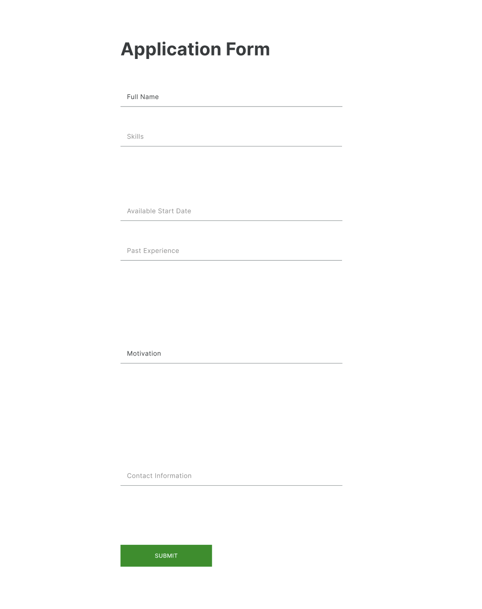
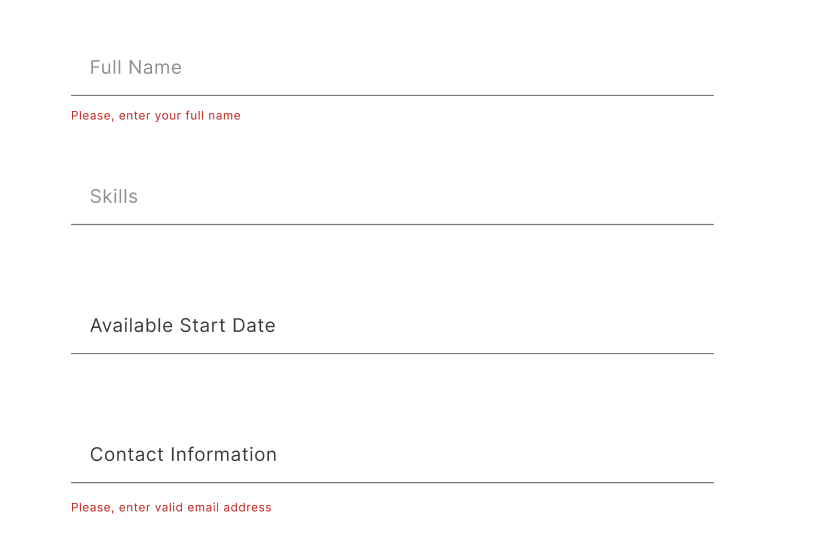
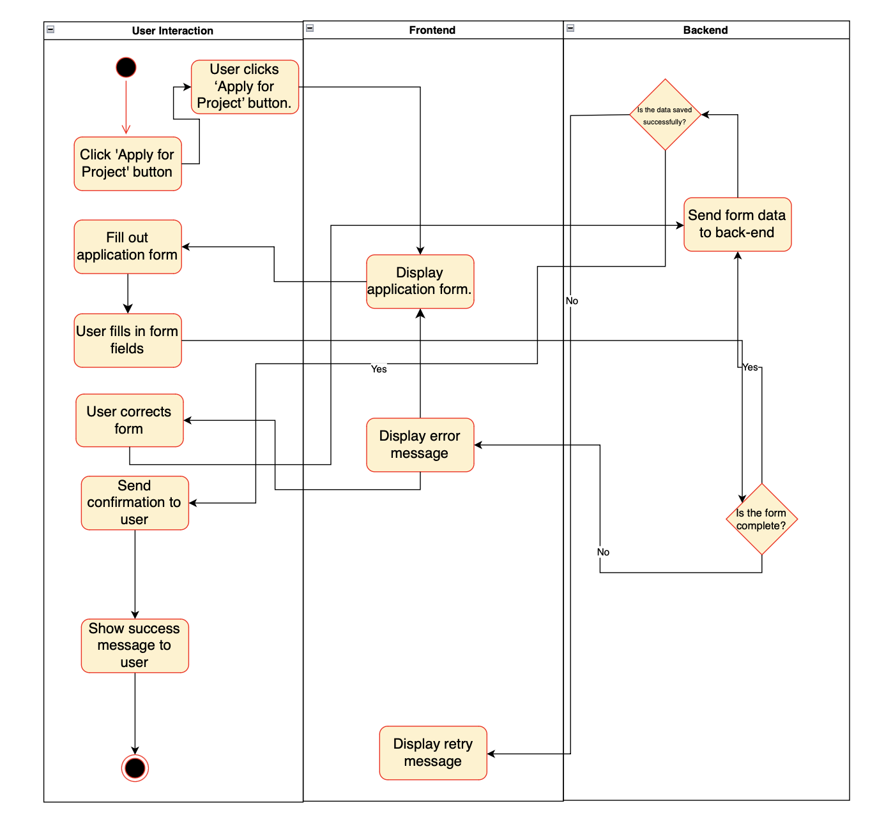

# Use-Case Specification: Applying for a Project

# 1. Applying for a Project

## 1.1 Brief Description
This use case allows hobby developers to apply for a project by filling out an application form. The form should include relevant information to help project owners evaluate candidates. If a developer wants to apply for a project, they need to fill in the following fields:

- Developer Name (Full name)
- Skills (relevant technical skills)
- Availability (start date, hours per week)
- Past Experience (brief description of relevant projects)
- Motivation (reason for applying)
- Contact Information (email or phone)


## 1.2 Mockup 


## 1.3 Screenshots
### Submit Action


### Input Missing


### Form Validation Error


# 2. Flow of Events

## 2.1 Basic Flow
- The developer clicks on the "Apply for Project" button.
- The "Application Form" template pops up.
- The developer fills in the template.
- The developer clicks on the "Submit" button.
- The application is sent to the project owner.

### Activity Diagram


### .feature File
The Gherkin script for this use case is available [here](../features/UC5_Applying_for_a_Project.feature)
```Gherkin
Feature: Applying for a Project
  As a hobby developer
  I want to apply for a project by filling out an application form
  So that I can be considered for the project by the project owner

  Background:
    Given the user is logged in as a hobby developer

  Scenario Outline: Successful application submission
    Given the developer fills in "<field>" with "<value>"
    When the developer clicks the "Submit" button
    Then the application is successfully submitted
    And a confirmation message is shown

  Examples:
    | field               | value                    |
    | Developer Name      | Yasaman Pandand          |
    | Skills              | Java, Python             |
    | Availability        | 20 hours/week            |
    | Past Experience     | Developed mobile apps    |
    | Motivation          | I am passionate about this project |
    | Contact Information | yasaman@gmail.com      |

  Scenario: Missing information error
    Given the developer leaves the "Skills" field empty
    When the developer clicks the "Submit" button
    Then an error message is displayed
    And the form is not submitted

  Scenario: Form validation error
    Given the developer enters an invalid email in the "Contact Information" field
    When the developer clicks the "Submit" button
    Then an error message is displayed indicating the email is invalid
    And the form is not submitted

## 2.2 Alternative Flows
- The developer cancels the application before submitting.
- The developer submits incomplete or incorrect data.

# 3. Special Requirements
- Form validation for mandatory fields (e.g., name, contact information).
- Data privacy considerations (sensitive info like contact details).

# 4. Preconditions
- The developer is logged in to the platform.
- The developer has clicked on the "Apply for Project" button.

# 5. Postconditions
- The application is sent to the project owner.
- The project owner receives a notification of a new application.

# 6. Function Points
n/a

# 7. CRUD Operation
This Use Case represents the "Create" operation in the CRUD (Create, Read, Update, Delete) model, as it involves the creation of an application by the developer.
