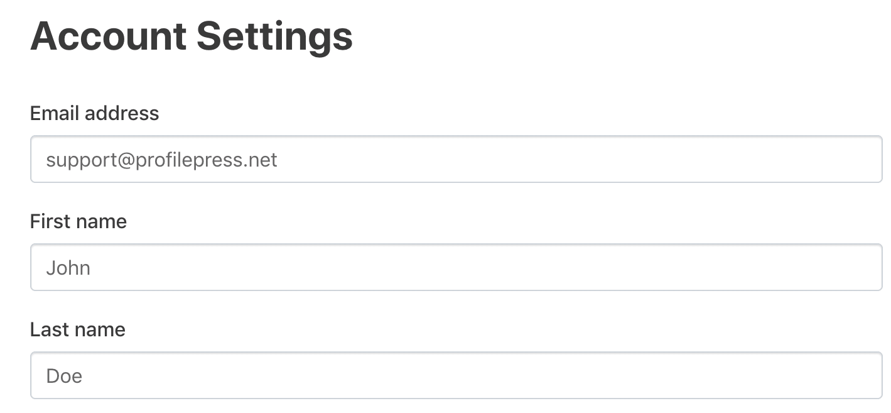

# Use Case Specification: Profile Editing

## 1. Profile Editing

### 1.1 Brief Description  
This use case describes how a user can edit their profile information within the system. The user can update personal details such as their first name, last name, username and email address. The user can also see their applications.

### 1.2 Mockup  


## 2. Flow of Events

### 2.1 Basic Flow  
1. The user navigates to their profile page.  
2. The system displays the current profile information.  
3. The user selects the "Edit Profile" option.  
4. The system presents editable fields for the user to update.  
5. The user modifies the desired fields.  
6. The user submits the changes.  
7. The system validates the input and updates the profile.  
8. A confirmation message is displayed to the user.

### .feature File
The Gherkin script for this use case is available [here](../features/uc8_editing_profile.feature)

```gherkin
Feature: Profile Editing
  As a registered user
  I want to edit my profile information
  So that I can keep my details up to date

  Scenario Outline: Successful Profile Update
    Given the user is logged in
    And the user navigates to the profile page
    And the user enters "<field>" with "<new_value>"
    When the user clicks the "Save Changes" button
    Then the profile is successfully updated
    And a confirmation message is displayed

    Examples:
      | field      | new_value         |
      | First Name | John              |
      | Last Name  | Doe               |
      | Username   | johnnydoe         |
      | Email      | john@example.com  |

  Scenario: Invalid Email Format
    Given the user is logged in
    And the user navigates to the profile page
    And the user enters "Email" with "invalid-email"
    When the user clicks the "Save Changes" button
    Then an error message is displayed indicating the email format is invalid
    And the profile is not updated

  Scenario: Cancel Editing
    Given the user is logged in
    And the user navigates to the profile page
    When the user clicks the "Cancel" button
    Then the user is returned to the profile page without saving changes

  Scenario: Missing Required Fields
    Given the user is logged in
    And the user navigates to the profile page
    And the user clears a required field
    When the user clicks the "Save Changes" button
    Then an error message is displayed indicating the required field is missing
    And the profile is not updated
```

#### Activity Diagram  


### 2.2 Alternative Flows  
- **Invalid Input:**  
  - If the user submits incomplete or invalid data (e.g., invalid email format), the system highlights the errors and requests correction.  
- **Cancel Editing:**  
  - The user may choose to cancel the editing process, returning to the profile view without saving changes.

## 3. Special Requirements  
- The system must validate all fields before saving changes.  
- Email addresses must follow proper formatting rules.  
- Profile updates must be confirmed before submission.

## 4. Preconditions  
- The user must be logged into their account.  
- The user must have an existing profile.

## 5. Postconditions  
- The user’s profile is successfully updated and saved in the system.  
- The system reflects the changes immediately or upon the next login.

## 6. Function Points  
- User Interface for editing profile fields  
- Input validation  
- Viewing user’s application history  
- Confirmation and error handling

## 7. CRUD Operation  
This Use Case represents an "Update" operation in the CRUD model, as it involves modifying the user's existing profile information.

